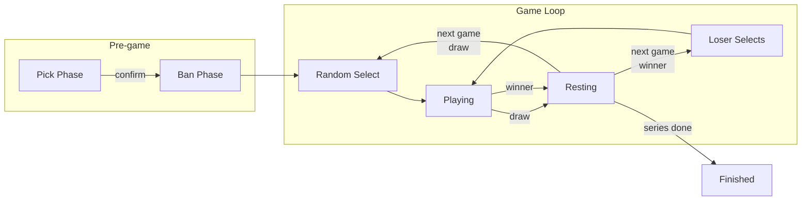

# Chess Opening Duel

A custom 1v1 chess game mode built on [lichess](https://github.com/lichess-org) [components](https://github.com/lichess-org/lila-docker). Players ban and pick from a pool of chess openings, then compete in a best-of-5 series starting from those positions.

## Screenshots

| Pick Phase | Ban Phase |
|:---:|:---:|
|  |  |

| Random Select | Loser's Choice |
|:---:|:---:|
|  |  |

| Game Play | Series Finished |
|:---:|:---:|
|  |  |

## How It Works



### 1. Pick Phase (30s)

Each player simultaneously selects 5 openings from a pool of 10. If time runs out, remaining slots are filled randomly.

### 2. Ban Phase (30s)

Each player bans 2 of their opponent's picks. After bans, each player has 3 openings remaining.

### 3. Playing

After each game ends, a **30-second resting period** gives both players time to review the game. Both can click to proceed early, or wait for the timer to expire.

The next opening is then determined by the result:
- **Draw** — randomly selected from the combined remaining pool
- **Winner decided** — the loser picks from their own remaining pool

After the final game, the resting period shows a **"View result"** button instead, leading to the finished page.

### 4. Series Result

First to **2.5 points** with a lead wins. If tied after 5 games (e.g. 2.5–2.5), sudden death games continue until one player pulls ahead.

## Game Modes

- **Opening Duel with a Friend** — Challenge a specific player from the lobby
- **Opening Duel with Anyone** — Register a hook and get auto-matched with an opponent of similar rating
- **Opening Duel with Computer** — Play against Stockfish AI (adjustable difficulty)

## Scoring

Standard chess scoring applies to each game:

| Result | Points |
|--------|--------|
| Win | 1 |
| Draw | 0.5 |
| Loss | 0 |

First to **2.5 points** with a lead wins the series. Tied at 2.5–2.5? **Sudden death** continues until someone breaks the tie.

## Opening Pool

Each player has a personal pool of **5–10 openings** used for the ban/pick phase. New accounts start with 10 default openings:

| ECO | Opening | Chooser Plays |
|-----|---------|:---:|
| C89 | [Ruy Lopez: Marshall Attack](https://lichess.org/opening/Ruy_Lopez_Marshall_Attack) | Black |
| C54 | [Italian Game: Classical Variation, Giuoco Pianissimo](https://lichess.org/opening/Italian_Game_Classical_Variation_Giuoco_Pianissimo) | White |
| D35 | [Queen's Gambit Declined: Normal Defense](https://lichess.org/opening/Queens_Gambit_Declined_Normal_Defense) | White |
| E05 | [Catalan Opening: Open Defense, Classical Line](https://lichess.org/opening/Catalan_Opening_Open_Defense_Classical_Line) | White |
| A22 | [English Opening: King's English, Two Knights](https://lichess.org/opening/English_Opening_Kings_English_Variation_Two_Knights_Variation) | White |
| B90 | [Sicilian Defense: Najdorf Variation](https://lichess.org/opening/Sicilian_Defense_Najdorf_Variation) | Black |
| E20 | [Nimzo-Indian Defense](https://lichess.org/opening/Nimzo-Indian_Defense) | Black |
| A56 | [Benoni Defense](https://lichess.org/opening/Benoni_Defense) | Black |
| B19 | [Caro-Kann Defense: Classical Variation](https://lichess.org/opening/Caro-Kann_Defense_Classical_Variation) | Black |
| C18 | [French Defense: Winawer Variation](https://lichess.org/opening/French_Defense_Winawer_Variation) | Black |

### Customizing Your Pool

Players can add or remove openings from the **Opening Explorer** (`/opening`). Your current pool is displayed as a table at the top of the page.

| Pool Table | Add Buttons |
|:---:|:---:|
|  |  |

Navigate to any opening page and use the **"Play as White" / "Play as Black"** buttons to add it to your pool.

**Requirements for adding an opening:**

- Must be an **exact opening position** — pages showing extra moves beyond a defined opening (e.g., "Italian Game: Giuoco Piano, Greco's Attack, Nxe4, O-O") are not eligible
- Must have a **balanced win rate** — openings where the white/black win rate differs by 15 percentage points or more are blocked
- Pool size must be **under 10** (the maximum)
- The same opening + color combination must **not already be in your pool**

**Removing openings:** Click the delete button next to any opening in your pool table (visible on `/opening` pages). The pool must keep at least 5 openings.

## Additional Features

- **How to Play** — Interactive tutorial tab in the lobby for new players
- **Sound Effects** — Audio cues for phase transitions, selections, and confirmations
- **Reconnection Banner** — Automatic detection and prompt to rejoin an in-progress series
- **Login Required** — Anonymous visitors are redirected to a standalone login page

## Quick Start

### Play (Docker)

```bash
docker run -d --name chess-duel \
  -p 8080:8080 \
  -v chess-data:/seeded \
  ghcr.io/chess-opening-duel/app:latest
```

Open http://localhost:8080 and log in with any seeded account (password: `password`).

### Development

See [CLAUDE.md](CLAUDE.md) for the full development guide, including Docker Compose setup, build commands, and project architecture.

```bash
git clone --recursive https://github.com/chess-opening-duel/app.git
cd chess-opening-duel
./lila-docker start
```

## Tech Stack

| Layer | Technology |
|-------|-----------|
| Backend | Scala, Play Framework, MongoDB, Redis |
| Frontend | TypeScript, Snabbdom |
| Chess Logic | scalachess |
| Board UI | chessground |
| Real-time | WebSocket (lila-ws) |
| Infrastructure | Docker, Caddy |

## Credits

Built on top of [lichess-org/lila](https://github.com/lichess-org/lila), the free and open-source chess server. Development environment based on [lila-docker](https://github.com/lichess-org/lila-docker).
